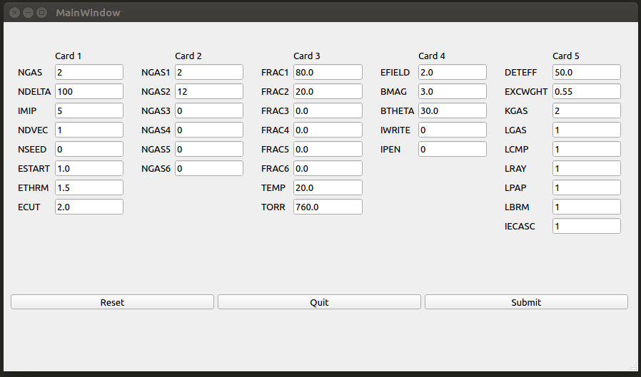

# Degrad Input interface via PyQt5 

## Using input interface of degrad  
### Installation 
 
    sudo pip3 install --user pyqt5  
    sudo apt-get install python3-pyqt5  
    sudo apt-get install pyqt5-dev-tools
    sudo apt-get install qttools5-dev-tools
### Usage

    python3 MAIN.py

main.ui is the UI file of the window.  
main.py is the python readable version of the ui file. Needs to be updated using 
    
    pyuic5 -o main.py main.ui 

everytime ui file is changed. 

### Functionalities 
<ol>
<li>Reset - it will reset all fields to a working set of values, which is defined in the code as default_0_values
<li>Quit - exit the window
<li>Submit - execute the degrad file with your chosen input
<li><em>degrad-3.3.f should be in the same directory as MAIN.py and main.ui </em>
</ol>

    
